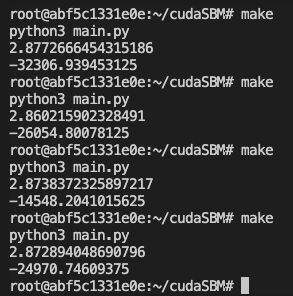

# CudaSimulatedBifurcationMachine

[Code Source](https://github.com/Shutoparu/CudaSimulatedBifurcationMachine)

Overall time complexity: O(sweep*dim)

## C code (sbm.c)

This is the c prototype of the algorithm.

## Cuda C code (sbm.cu)

Used OS: Ubuntu 20.04.3 LTS

kernel: Linux 5.13.0-51-generic

Used image version: nvidia/cuda:10.0-devel-ubuntu18.04

command to create container: 

> docker run -it --gpus all nvidia/cuda:10.0-devel-ubuntu18.04 bash

To compile and run the Cuda C code, run in terminal:

> nvcc cudaDigitalAnnealing.cu -o ./bin/sbm_cu.o \
> ./bin/sbm_cu.o

This will lead to a test code with dimention = 2, using J matrix = [[0,1],[1,0]],

or simply use the Makefile command to launch the algorithm with python code

> make

You can customize different parameters in the python code. More description in "python" section

### result: 

With dimention = 10,000 and 1000 iterations, the algorithm is able to locate several different local minimums within 3 seconds.\
Multiple runs can help locate global minumum of the algorithm. Note that dimention = 40,000 may lead to memory issues?\
Also accuracy needs to be tested in the future

## python code (main.py)

This is the code that allow users to test different dimentions. to input own data import the main.py file.

Used Python version: 3.6.9 64bit

The code throws a qubo matrix and a state array into the cuda code and calculate the energy